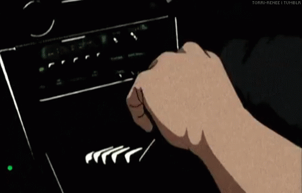

<div align="center">
    <a href="https://github.com/kawarimidoll/typograssy">
        
    </a>
    <p>
        
        <a href="https://x.com/MAditya9210">
            
        </a>
        <a href="https://www.instagram.com/spiropunk/">
            
        </a>
        <a href="https://adityas221b.github.io/">
            
        </a>
        <a href="mailto:spirokinetics@gmail.com">
            
        </a>
    </p>
</div>

<br>

<div align="center">
    
</div>

<br>

<h2 align="center"> 👁️ About Me 👁️ </h2>

```zsh
aditya@221b: ~/profile (main⚡)$ neofetch
```


```python
# whoami
{
  name      : "Adityas221b",
  college   : "BITS Pilani — CS '27",
  vibe      : "CV Researcher by day 👁️ | Hackathon runner by night 🏃‍♂️",
  stack     : ["Python", "PyTorch", "C++", "OpenCV", "Linux"],
  currently : "making computers see things 🤖",
  anime     : ["Initial D 🚗", "Gintama ⚔️", "Naruto 🍥"],
  hobbies   : ["Speedcubing 🧩", "Track & Field", "breaking prod"],
  quote     : "Don't give up. It's just a detour." — Gintoki
}
```

<br>
<br>

---

<h2 align="center"> 🛠️ things i use </h2>
<p align="center">
    <a href="https://skillicons.dev">
        
    </a>
</p>

<br>

<h2 align="center"> 🚀 stuff i built </h2>

| | |
|:---|:---|
| 👁️ **Stereo Depth for Robots** | making agricultural bots see in 3D — novel research, 94–99% accuracy |
| 🎭 **Face Recognition** | 98–99% accuracy even under blur, noise & bad lighting |
| 🎤 **Audio Deepfake Detector** | Macro-F1 = 0.9991 · Comsys Hackathon 4th Place |
| 🤖 **AI Voice Interviewer** | ~2s latency · cheating detection · Eightfold AI Finalist |
| ☁️ **Multi-Cloud Orchestrator** | 40–60% storage cost cut · NetApp Hackathon Finalist |
| 🐛 **Bug Bounty @ FamPay** | found critical vuln · patched in 72h · saved ₹4L+ |

<br>

<h2 align="center"> 🏆 quick wins </h2>
<p align="center">

`5+ Hackathon Finals 2025` &nbsp;•&nbsp; `Undergrad Researcher @ BITS Yr.2` &nbsp;•&nbsp; `Bug Bounty @ YC-backed FamPay` &nbsp;•&nbsp; `Open to EU Research Internship 🌍`

</p>

<br>
<br>

<h2 align="center"> 🎵 What I'm Listening To </h2>

<div align="center">
    <a href="https://open.spotify.com/playlist/63o6gCWXrKhQTwi6WJqTeC?si=05c7c13ecf46403a" target="_blank">
        
    </a>
    <br>
    <a href="https://open.spotify.com/playlist/5sUwmMEkTnqKySMT1YnTgo?si=9e3108987aa74ceb" target="_blank">
        
    </a>
</div>

<br>
<br>

<h2 align="center"> 📊 GitHub Stats </h2>

<div>
    <p align="center">
        <a href="https://git.io/streak-stats">
            
        </a>
    </p>
    <p align="center">
        <a href="https://github.com/ashutosh00710/github-readme-activity-graph">
            
        </a>
    </p>
    <p align="center">
        
    </p>
</div>

<br>
<br>

<h1 align="center"> My Contribution Snake 🐍⚡ </h1>


<br>

<h2 align="center"> 📝 Contact Me 📝 </h2>

<br>

<div align="center">
    <a href="https://github.com/Adityas221b" target="_blank">
        
    </a>
    <a href="https://x.com/MAditya9210" target="_blank">
        
    </a>
    <a href="https://www.instagram.com/spiropunk/" target="_blank">
        
    </a>
    <a href="https://www.threads.com/@spiropunk" target="_blank">
        
    </a>
    <a href="mailto:spirokinetics@gmail.com" target="_blank">
        
    </a>
    <a href="https://adityas221b.github.io/" target="_blank">
        
    </a>
    <br><br>
    
</div>

<br>

<div>
    <h2 align="center"> Thanks for stopping by 🙋‍♂️⚓ </h2>
    <div align="center">
        
    </div>
</div>

<br>
<br>

<h1 align="center"> Support My Work ⚡🔥 </h1>

<p align="center">
    <a href="https://www.buymeacoffee.com/Adityas221b" target="_blank">
        
    </a>
</p>

<br>
<br>
